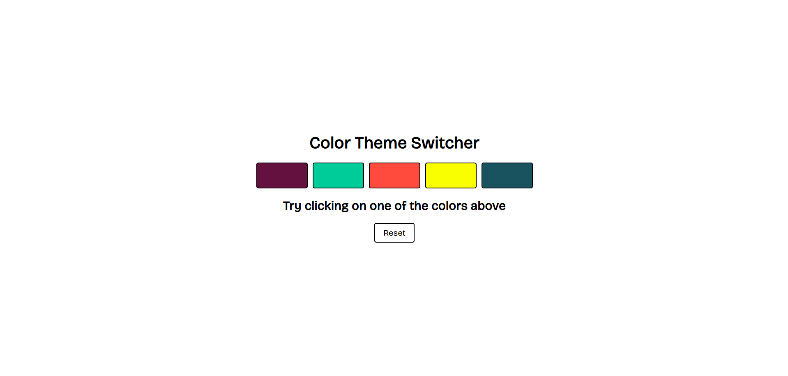
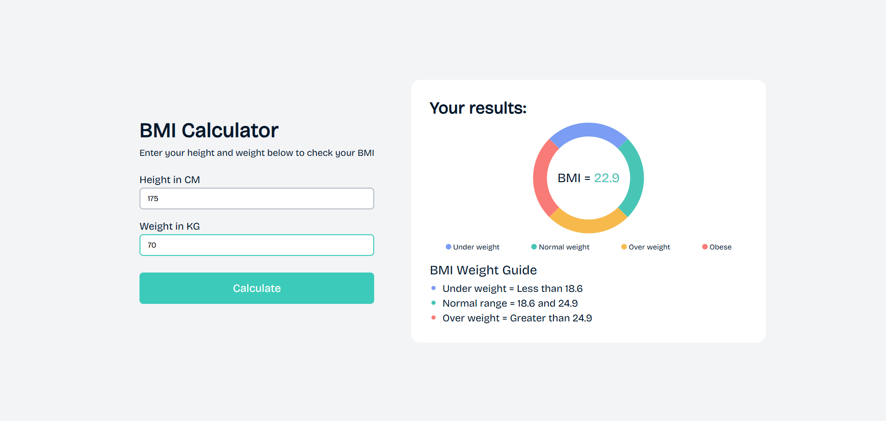
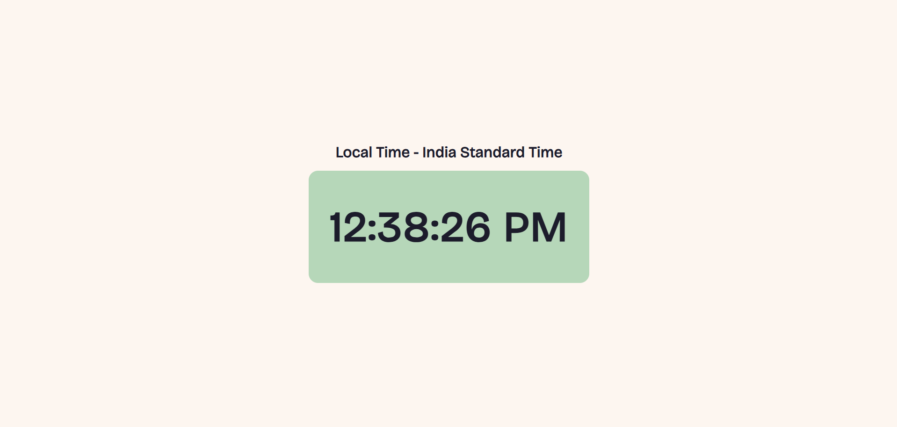
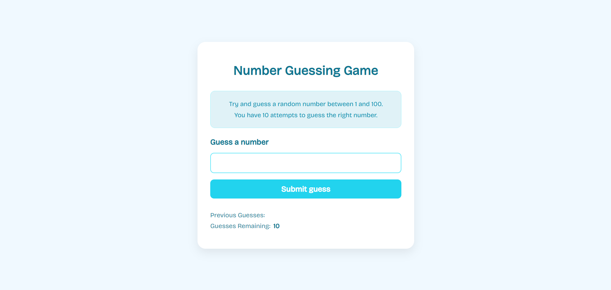
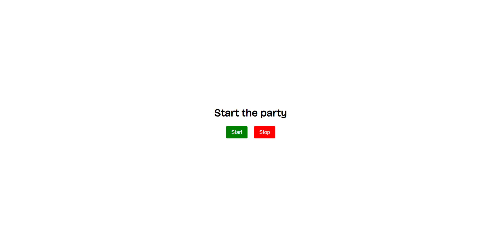
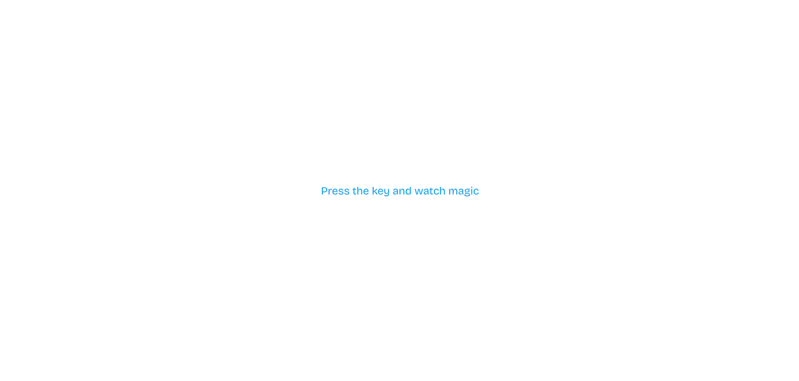

# Practice projects for JS

## Project 1 - BG Changer

A simple project to change the background color dynamically with user interaction.

[Live Demo](https://tharuntadisetty04.github.io/js-practice/bg-changer/)

## Project 2 - BMI Calculator

Calculate your Body Mass Index (BMI) based on height and weight inputs.

[Live Demo](https://tharuntadisetty04.github.io/js-practice/bmi-calculator/)

## Project 3 - Digital Clock

A real-time digital clock displaying the current time.

[Live Demo](https://tharuntadisetty04.github.io/js-practice/digital-clock/)

## Project 4 - Number Guessing Game

A fun game where you guess a randomly generated number within a range.

[Live Demo](https://tharuntadisetty04.github.io/js-practice/num-guessing-game/)

## Project 5 - Disco Party

A colorful and interactive project that creates a disco party effect by rapidly changing background colors and adding fun animations.

[Live Demo](https://tharuntadisetty04.github.io/js-practice/disco-party/)

## Project 6 - Keylogger

A simple keylogger app that displays the key, key code, and code of any key you press in a styled table.

[Live Demo](https://tharuntadisetty04.github.io/js-practice/keylogger/)
